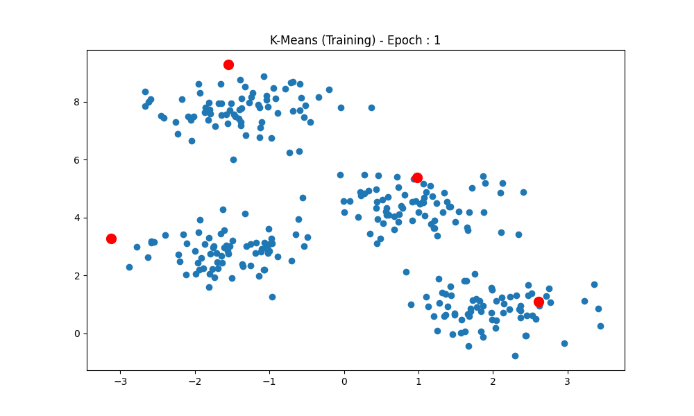
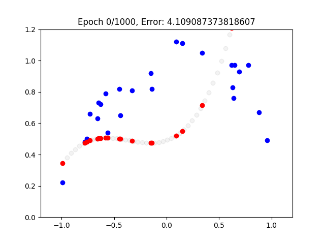
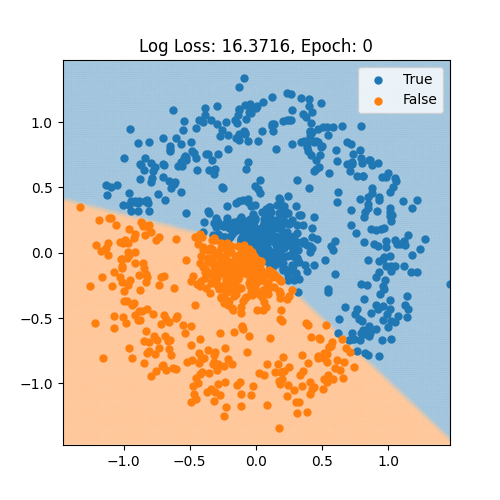

# Medium Code + More

This repository contains code for my [medium articles](https://medium.com/@BrendanArtley), and other interesting code snippets that I put together.

## Random Code
### kmeans.py

Numpy implementation of K-means clustering algorithm with random or k++ initialization.

### linear_reg_nth.py

Numpy implementation of linear regression to the nth degree.

### neural_network_classification.py

Animated model training of a deep neural network in Tensorflow.

